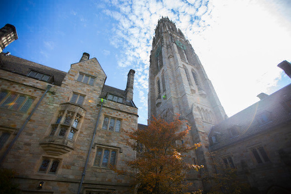
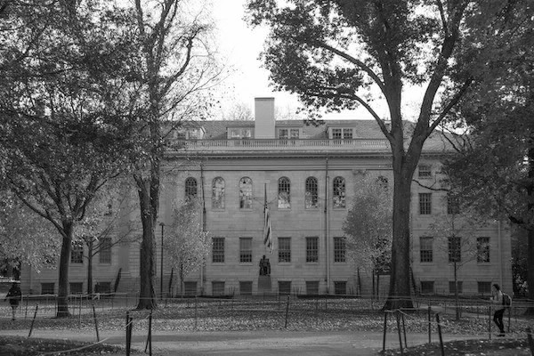

# CS50: Image Filtering

## Project done in Harvard CS50 - Introduction to Computer Science course.

It's a simple C application for modiying the RGB bits in a BMP image and applying some effects like Sepia, Grayscale and Blur.

* Sepia:

<table>
    <tr>
        <td></td>
        <td></td>
    </tr>
</table>

* Grayscale:

<table>
    <tr>
        <td></td>
        <td></td>
    </tr>
</table>

* Blur:

<table>
    <tr>
        <td></td>
        <td></td>
    </tr>
</table>

You can test the application using:
> make

> ./filter -s infile.bmp outfile.bmp - *Sepia*

> ./filter -g infile.bmp outfile.bmp - *Gray*

> ./filter -b infile.bmp outfile.bmp - *Blur*
